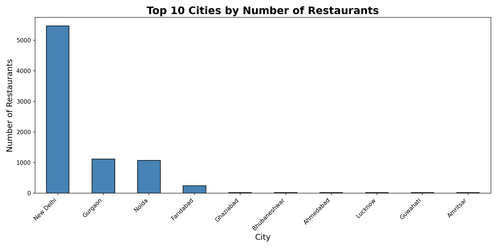
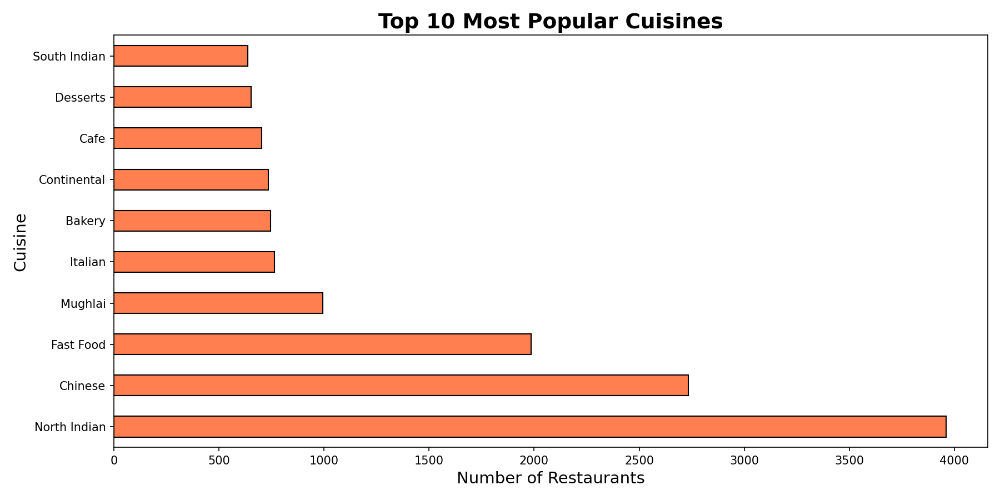
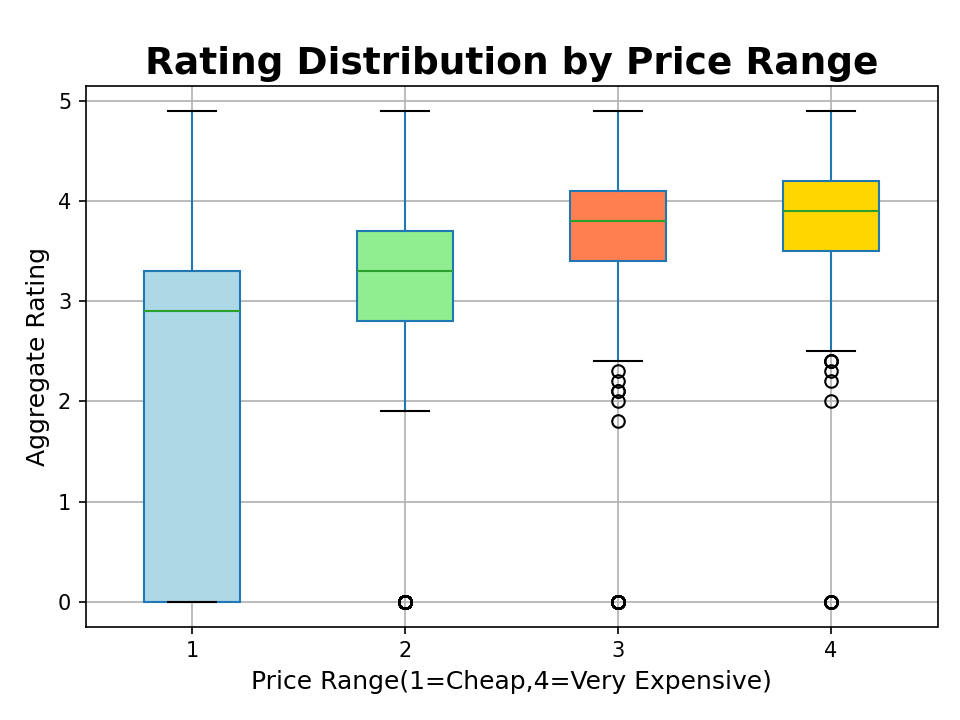
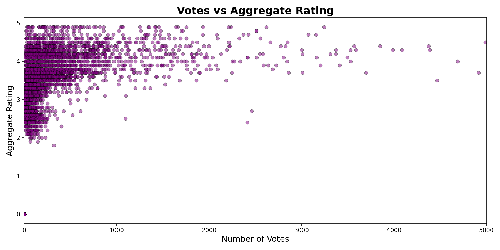
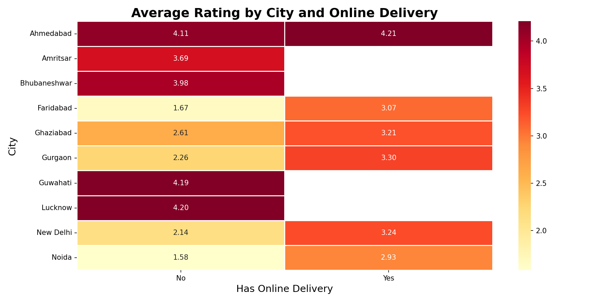

# Zomato Restaurant Analysis
## Pluto Academy AI & ML Internship — Project 1

---

## 📌 Project Overview
Performed Exploratory Data Analysis on 9,551 Zomato restaurants
to identify trends in cuisines, city distribution, ratings,
online delivery impact, and pricing patterns.

---

## 🛠️ Tools Used
- **Python** (Pandas, Matplotlib, Seaborn)
- **Google Colab**

---

## 📁 Dataset
- Source: Zomato Restaurants Data (Kaggle)
- Size: 9,551 restaurants | 21 columns
- Link: https://www.kaggle.com/datasets/shrutimehta/zomato-restaurants-data

---

## 📊 EDA Questions Answered
1. Which city has the most restaurants?
2. What are the most popular cuisines?
3. What is the rating distribution?
4. Does online delivery affect ratings?
5. Which price range has best ratings?

---

## 🔍 Key Findings
1. **New Delhi** dominates with 5,473 restaurants — 5x more than Gurgaon
2. **North Indian** is most popular cuisine (3,960 restaurants)
3. **39.1%** restaurants rated Average — only 3.1% Excellent
4. Online delivery restaurants rated higher (3.25 vs 2.46)
5. Higher price range = better ratings (3.82 vs 2.00)

---

## 📈 Visualisations
| Chart | Type |
|-------|------|
| Top 10 Cities | Bar Chart |
| Top 10 Cuisines | Horizontal Bar Chart |
| Rating Distribution | Pie Chart |
| Rating by Price Range | Box Plot |
| Votes vs Rating | Scatter Plot |
| City vs Online Delivery | Heatmap |

---

## 📂 Files in this Repository
| File | Description |
|------|-------------|
| `AIML_Project1_Zomato_EDA.ipynb` | Main analysis notebook |
| `zomato.csv` | Original dataset |

---

## 🔍 Most Surprising Finding
Restaurants with online delivery score 0.79 points higher 
in ratings than those without — suggesting online delivery 
strongly correlates with better customer satisfaction!

---

## 📊 Chart Previews

### Top 10 Cities

### Top 10 Cuisines

### Rating Distribution

### Rating by Price Range

### Votes vs Rating

### City vs Online Delivery Heatmap

---

## 🔗 Google Colab Notebook
[Click here to view notebook]https://colab.research.google.com/drive/1Q-bOIQyeiYE8mSGoIsoZWs2pDtNqsfZi?usp=sharing
